<p align="center">
  
</p>

<p align="center">
  <em>A fast, minimal TUI launcher for SSH and other remote shells.</em>
</p>

<p align="center">
  <a href="https://github.com/Jaydee94/hoppr/actions/workflows/ci.yml"></a>
  <a href="https://github.com/Jaydee94/hoppr/releases"></a>
  <a href="LICENSE"></a>
  
</p>

<p align="center">
  
</p>

<p align="center"><sub>Four keystrokes, four panels: <code>Tab</code> to focus hosts → <code>/</code> to fuzzy-search → <code>e</code> for the in-TUI editor → <code>↩</code> to hand off to ssh. Animated GIF: install <a href="https://github.com/charmbracelet/vhs">VHS</a> and run <code>vhs assets/demo.tape</code> to regenerate <code>assets/demo.gif</code>.</sub></p>

---

## What it does

`hoppr` is a tiny TUI you keep on a hotkey. Type to fuzzy-search hosts, hit `↩` to drop into an SSH session — no shell aliases to maintain, no copy-pasting from a notes file. Hosts live in a YAML file you can edit by hand, from inside the TUI, or sync from a central git repo across your machines.

```bash
$ hoppr            # interactive TUI
$ hoppr connect prod-gateway
$ hoppr list --category prod
$ hoppr sync push  # commit + push your local edits upstream
```

## Highlights

- **Fast TUI** — built on [ratatui](https://github.com/ratatui-org/ratatui), opens in < 50 ms.
- **In-TUI settings** — add hosts, edit categories, change defaults, save to YAML. No shelling out to an editor.
- **Team inventory in git** — point at a repo URL; hoppr auto-clones, fast-forward pulls the shared categories & hosts on every launch, pushes the inventory subset when you want. Your local `defaults` and `sync` settings stay on your machine.
- **Pluggable connect command** — defaults to `ssh`, supports `mosh`, `telnet`, `kitty +kitten ssh`, raw shell, or any custom template with `{user}` `{host}` `{port}` placeholders.
- **Favorites & history** — `f` stars a host into a virtual `★ Starred` category. The last 10 connections appear under `🕒 Recent`. Both persist across sessions, never synced to the central repo.
- **Global search** — `Ctrl+A` while searching switches to cross-category fuzzy search; results show the originating category name.
- **New-window launch** — `Shift+Enter` opens the connection in a fresh terminal window. hoppr auto-detects Windows Terminal, iTerm2, GNOME Terminal, Konsole, or xterm; override via `defaults.terminal_command`.
- **CLI parity** — every TUI action is also a subcommand (`connect`, `list`, `sync`, `config`, `history`).
- **Cross-platform** — Linux, macOS, Windows. Single static binary.

## Install

### Pre-built binaries

```bash
# pick the asset for your OS from the latest release:
#   https://github.com/Jaydee94/hoppr/releases/latest
curl -L https://github.com/Jaydee94/hoppr/releases/latest/download/hoppr-linux-x86_64.tar.gz \
  | tar -xz -C ~/.local/bin
```

### From source

```bash
git clone https://github.com/Jaydee94/hoppr.git
cd hoppr
cargo install --path .
```

## Quick start

```bash
hoppr config init        # writes ~/.config/hoppr/config.yaml
hoppr                    # launch the TUI
```

Inside the TUI:

| key       | action                          |
| --------- | ------------------------------- |
| `Tab`     | switch between Categories / Hosts |
| `/`       | search                          |
| `↑ ↓ j k` | navigate                        |
| `↩`       | connect to the selected host    |
| `e`       | open the in-TUI settings menu   |
| `q` `Esc` | quit                            |

## Docs

The full reference lives in [`docs/`](./docs):

- [`docs/configuration.md`](docs/configuration.md) — YAML schema, defaults, alternative connect commands
- [`docs/cli.md`](docs/cli.md) — every subcommand and flag
- [`docs/sync.md`](docs/sync.md) — central-repo sync, credentials, auto-push
- [`docs/keybindings.md`](docs/keybindings.md) — keymap for browse + edit modes
- [`docs/design-system.md`](docs/design-system.md) — color tokens & UI primitives
- [`docs/development.md`](docs/development.md) — build, test, release flow

## Contributing

Contributions welcome — see [`CONTRIBUTING.md`](CONTRIBUTING.md). All commits must follow [Conventional Commits](https://www.conventionalcommits.org/); the release workflow turns the log between tags into the release notes.

## License

[MIT](LICENSE) · © 2026 hoppr contributors
